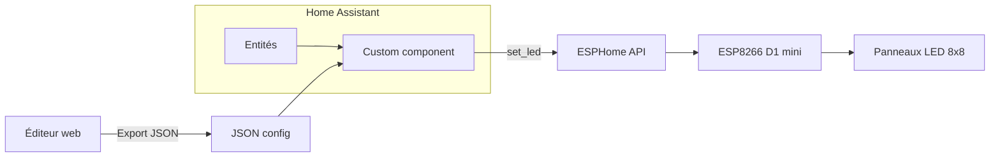

# Suivi du projet HA-LED-Status-Panel

**Repo :** [HA-LED-Status-Panel](https://github.com/djiesr/HA-LED-Status-Panel)  
**Concept :** voir [Ha led status.txt](Ha%20led%20status.txt)

Vue d’ensemble et suivi des tâches pour les 4 parties du projet.

---

## 1. Parties du repo

| Dossier | Rôle |
|---------|------|
| `esphome/` | Firmware ESP8266 (D1 mini), composant custom LED, service `set_led` |
| `custom_components/led_status_panel/` | Intégration Home Assistant : chargement JSON, écoute entités, règles, appels ESPHome |
| `web-editor/` | Éditeur visuel React (grille LEDs, règles, API HA, export JSON), i18n FR/EN |
| `documentation/` | Doc technique et utilisateur |

---

## 2. Phases de développement

| Phase | Nom | Contenu principal | Statut |
|-------|-----|-------------------|--------|
| 1 | Firmware ESPHome | Composant custom LED, service `set_led`, config ESP8266 D1 mini, test 1 panneau 8x8 | En cours |
| 2 | Éditeur visuel | App React, 3 colonnes, API HA, import/export JSON, i18n FR/EN, App HA (panel_custom) | Fait |
| 3 | Intégration HA | Custom component : entity_id, JSON async, règles (state/attribute), service set_led, délai 45 s | Fait |
| 4 | Multi-panneau | Support 2–3 panneaux, topologies serpentin, orientation, tests réels | À faire |
| 5 | Raffinement | Import JSON, App HA, doc ; reste : mode nuit, polish UI, questions ouvertes | En cours |

---

## 3. Tâches détaillées par phase

### Phase 1 — Firmware ESPHome

- [x] Projet YAML ESPHome pour ESP8266 D1 mini
- [x] Composant custom (ou lambda) pour bande WS281x, contrôle LED par index
- [x] Service `set_led` (index, R, G, B, brightness, behavior)
- [x] Implémentation des behaviors : solid, blink_fast, blink_slow, pulse, off
- [x] Mapping (panel, row, col) → index LED (1 panneau 8x8)
- [ ] Test physique sur 1 panneau 8x8

### Phase 2 — Éditeur visuel

- [x] Init projet React + i18n (EN + FR)
- [x] Grille 8x8 (1 à 3 panneaux côte à côte)
- [x] Sélection de LEDs (clic) pour former un groupe
- [x] Panneau de config : entité HA, importance (low/medium/high), règles (condition, couleur, behavior)
- [x] Connexion API HA (URL + Long-Lived Access Token), stockage localStorage (jamais dans le JSON exporté)
- [x] Recherche / sélection d’entités HA via API (colonne « Entités »)
- [x] Export JSON (format du concept)
- [x] Import JSON
- [x] Prévisualisation couleur (cases assignées, sélection en cours)
- [x] UI 3 colonnes : Entités | Assignation (possibilités, supprimer une règle) | Panneaux (supprimer une case, tout supprimer)
- [ ] Config type de serpentin (zigzag horizontal, etc.) dans l'éditeur

### Phase 3 — Intégration HA (Custom component)

- [x] Structure du custom component (manifest, __init__, etc.) compatible HA 2026.3
- [x] Chargement asynchrone du fichier JSON de config (pas de blocage event loop)
- [x] Config : `config_file` + `entity_id` (entité ESPHome du panneau), plus `device_id`
- [x] Listeners sur `state_changed` pour les entités listées dans les assignations
- [x] Évaluation des règles (ordre, première condition vraie) : unavailable, default, state/attribute avec ==, !=, <, <=, >, >= (et `=` accepté)
- [x] Appel au service `esphome.led_status_panel_set_led` (sans target ; un seul panneau recommandé). Délai 45 s au démarrage ; ServiceNotFound géré (un avertissement, pas de traceback)
- [x] Calcul des index LED à partir de (panel, row, col) et layout (serpentin)
- [x] Gestion des entités indisponibles (règle unavailable)

### Phase 4 — Multi-panneau

- [ ] Calcul d’index pour 2–3 panneaux (chaîne en serpentin)
- [ ] Paramétrage topologie serpentin dans la config (zigzag horizontal, vertical, etc.)
- [ ] Option orientation par panneau (0°, 90°, 180°, 270°) si décidé
- [ ] Tests réels avec 2–3 panneaux

### Phase 5 — Raffinement

- [x] Import JSON dans l’éditeur (rechargement config existante)
- [x] Éditeur en « App » HA : build `npm run build:ha`, copie dans `www/led-panel-editor/`, `panel_custom` dans configuration.yaml
- [ ] Mode nuit : facteur global sur les luminosités (côté HA ou ESP)
- [ ] UI polish (éditeur et doc)
- [x] Documentation utilisateur (README custom component + web-editor, dépannage, entity_id, plusieurs panneaux)
- [ ] Clôture des questions ouvertes (section 10 du concept)

---

## 4. Décisions prises

- **Intégration HA :** Custom component (pas AppDaemon) pour limiter les ressources. Config par `entity_id` (entité ESPHome du panneau), pas `device_id`.
- **Service ESPHome :** Appel sans `target` (l’API rejette entity_id dans les data). Un seul panneau recommandé ; avec plusieurs, « Service not found » possible — contournement : script/automation ou un seul device avec ce service.
- **Démarrage :** Application de l’état initial après 45 s. Si le service n’est pas encore enregistré, un seul warning, pas de traceback ; mise à jour au prochain changement d’état.
- **Hardware :** ESP8266 D1 mini ; 1 panneau 8x8 pour démarrer.
- **Éditeur :** React, i18n FR/EN. 3 colonnes (Entités, Assignation, Panneaux). Peut être servi comme App HA via `panel_custom`.
- **Licence :** MIT. Projet ouvert et gratuit.
- **Home Assistant :** cible 2026.3.

---

## 5. Questions ouvertes (à trancher)

| Question (voir concept §10) | Décision / Statut |
|-----------------------------|-------------------|
| Gérer l’orientation physique des panneaux (rotation) dans l’éditeur ? | À trancher |
| Supporter les conditions sur attributs HA (ex. `attribute.battery_level`) ? | Fait (attribute.xxx, ==, !=, <, <=, >, >=) |
| Mode "night" (réduction luminosités après une heure) ? | À trancher (recommandé : oui, facteur global côté HA) |
| Éditeur : API HA en HTTP direct ou proxy local (CORS) ? | À trancher (dev : proxy ; prod : direct si servi depuis HA) |

---

## 6. Flux de données

---

*Dernière mise à jour : Mars 2026*
